# Persiapan dan langkah - langkah

 TEXT EDITOR (Sublime Text)

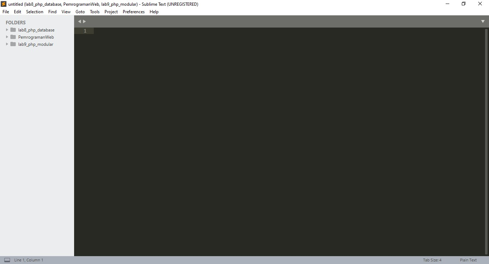

 XAMPP 

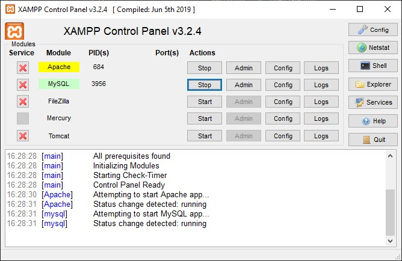

 Membuat foldernya 

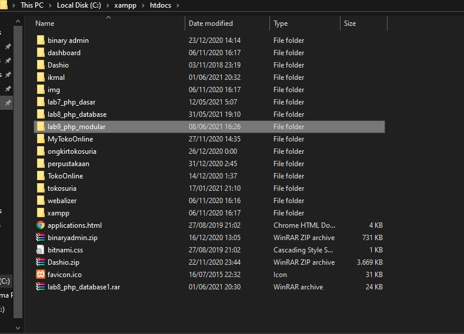

 Buka Chrome dan akses localhostnya 

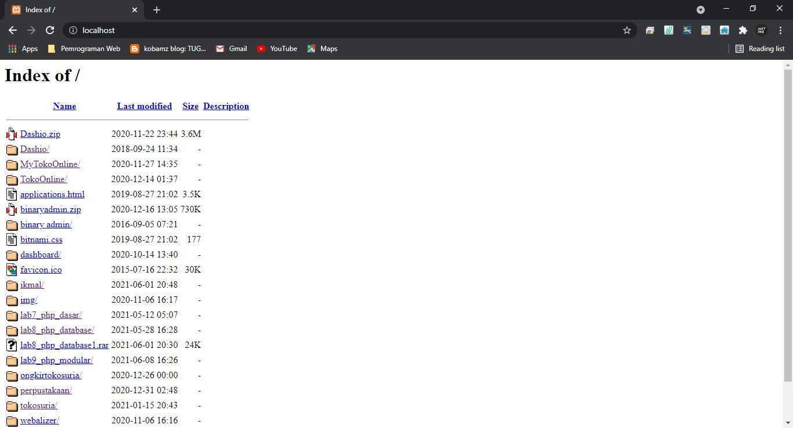

 Hasil output home 

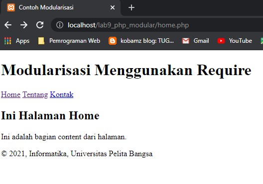

 Hasil output about 

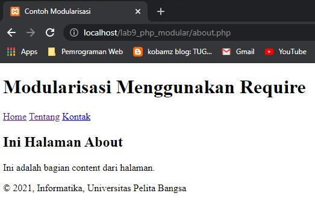

# <b>Pertanyaan dan Tugas</b> 

 Implementasikan konsep modularisasi padakode programpraktikum 8tentang database,sehingga setiap halamannya memiliki template tampilan yang sama. 

 Membuat file footer.php untuk kemudian di masukan ke index dengan menggunakan require 

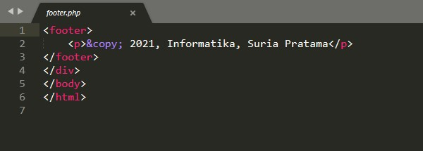

 Membuat file header.php untuk kemudia di masukan ke index dengan menggunakan require 

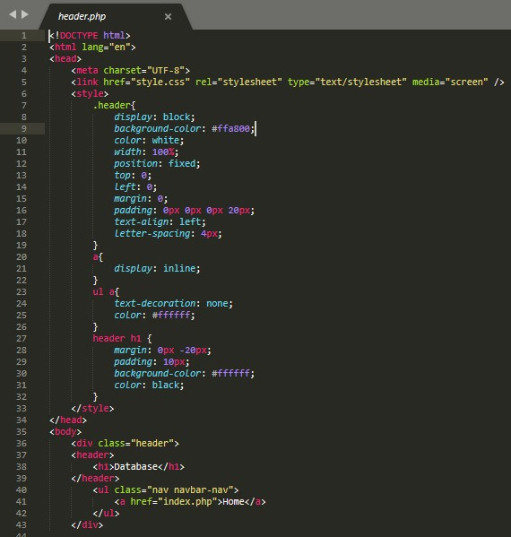

 Hasil tampilan home atau indexnya 

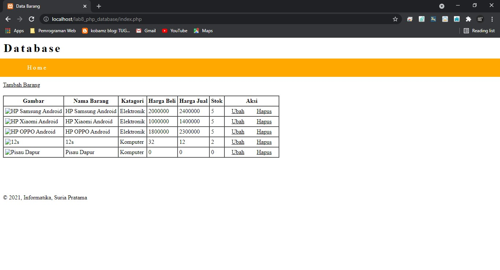

 Hasil tampilan tambah barangnya 

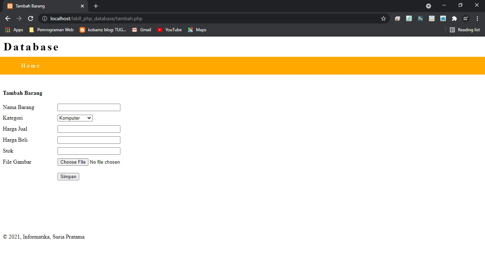

 Hasil tampilan ubah barangnya 

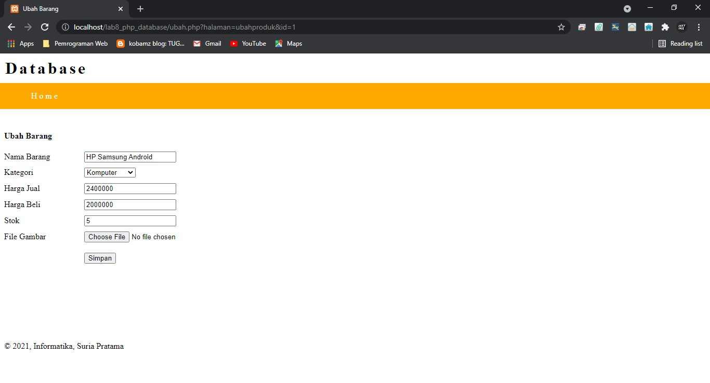
